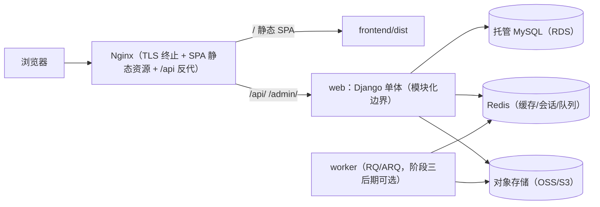
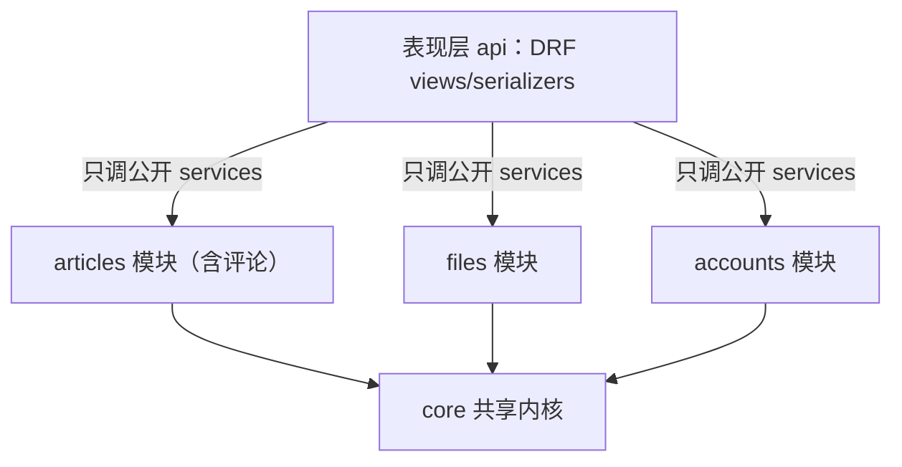
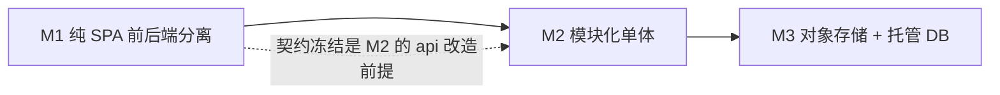

# NCBCNet 架构演进路线与实现规范

> 版本：v0.2（2026-08-12）
> 状态：**M1 / M2 / M3 已实现落地**（见下方「实现状态」）
> 关联文档：
> - [docs/FRONTEND_MIGRATION_PLAN.md](./FRONTEND_MIGRATION_PLAN.md) —— 前端改造的功能级计划（阶段一至六，全部完成）
> - [docs/DEVELOPMENT_AND_DEPLOYMENT_GUIDE.md](./DEVELOPMENT_AND_DEPLOYMENT_GUIDE.md) —— 当前开发/部署操作手册

---

## 0. 实现状态（v0.2 落地清单）

- **M1 纯 SPA 前后端分离**：`docker/nginx.Dockerfile` 构建期产出 SPA，Nginx 服务 SPA 静态 + `/api/` 反代；`/api/v1/` 契约、统一错误、`/api/v1/health/`、DRF 限流、CSP、移除 CORS、`.env.example`、依赖清理均已落地。
- **M2 模块化单体**：`core` 共享内核 + 各 app `services.py`；`comment` 已并入 `article`（`db_table='comment_comment'` 保留原表）；`api` 收口为薄适配层且零业务 model 依赖；`pyproject.toml` import-linter 契约 + AST 边界测试。
- **M3 配置/脚本**：`django-storages` S3 兼容存储配置、`migrate_media_to_oss` 命令、`deploy/backup.sh`、RQ `worker`（`core/tasks.py` + Compose 服务）、日志/密钥/健康检查规范。
- **授权访问**：HttpOnly Cookie JWT（`nc_access`/`nc_refresh`）+ CSRF + 私有文件 **HMAC 签名短链**下载（见 `SECURITY.md`）。

---

## 1. 文档定位

本文档是 **NCBCNet 的架构级路线图与实现规范**，回答三个问题：

1. 从现有架构（Django MVT 单体 + 未接入生产的 React SPA + DRF API）演进到目标架构，分几步走？
2. 每一步的**技术规范**是什么（怎么接线、怎么改代码、怎么验收）？
3. 目标架构与现有框架相比，**收益、代价和取舍**在哪里？

### 1.1 适用范围与假设

- 项目定位：校园/社区综合服务平台（论坛 + 云盘 + 学习），低并发、中小数据量。
- 维护人力：1–2 人，非专职运维。
- 预算：云资源低配起步（单台轻量服务器 + 托管数据库/对象存储按量付费）。
- 若上述假设变化（例如变成高并发 SaaS 或多租户运营），需重新评估本路线（见第 9 章决策记录）。

---

## 2. 现状盘点（现有框架）

### 2.1 现有技术栈

| 层级 | 技术 | 说明 |
|---|---|---|
| 前端 | React 19 + Ant Design 6 + Vite 7 + React Router 7 | SPA 已完成页面级开发，但**未接入生产** |
| 后端 | Django（requirements 锁 6.0.2，README 标注 5.1.1）+ DRF 3.16 + SimpleJWT | 单体，ASGI/Daphne |
| 数据库 | 开发 SQLite，生产 MySQL 8（Docker 容器） | 两套环境 schema 有漂移风险 |
| 缓存/会话 | Redis 7 + django-redis（cache 后端会话） | 已就绪 |
| 部署 | Docker Compose（nginx + web + db + redis），GHCR 镜像，GitHub Actions | 单机、命名卷存储媒体 |
| 渲染 | 旧 MVT 模板（Bootstrap/jQuery）+ 新 SPA 并存 | 双前端、双认证 |

### 2.2 现有架构的强项（保留项）

- **开发效率高**：Django ORM/Admin/Migration 成熟，SimpleUI 后台开箱即用。
- **部署简单**：单机 Compose 一条命令，TLS 由 Nginx 单点终止。
- **基础能力齐全**：Redis 会话/缓存、JWT 认证、大文件上传（2GB）、X-Accel 保护下载、限流（django-ratelimit）均已就位。
- **CI 已在工作**：后端测试 + 前端构建 + GHCR 镜像推送。

### 2.3 现有架构的主要问题（证据）

| # | 问题 | 代码/配置证据 |
|---|---|---|
| P1 | **SPA 未接入生产**：`frontend/dist` 无人服务，线上 `/` 仍渲染服务端首页 | [nginx/nginx.conf](../nginx/nginx.conf) 无 dist 路由；[Dockerfile](../Dockerfile) 与 [docker-image.yml](../.github/workflows/docker-image.yml) 构建前端后丢弃产物 |
| P2 | **双前端 + 双认证并存**：模板（session）与 SPA（JWT）路由同名 | [frontend/src/App.jsx](../frontend/src/App.jsx) 路由 `/usermanage/login`、`/file_up/file_list` 与 Django 模板 URL 重名；[api.js](../frontend/src/services/api.js) 用 `window.location.href` 整页跳转 |
| P3 | **API 适配层直连业务 models，无边界**：`api/` 同时 import 4 个业务 app 的模型 | [api/views/articles.py](../api/views/articles.py)、[api/views/files.py](../api/views/files.py)、[api/views/comments.py](../api/views/comments.py) |
| P4 | **article ↔ comment 循环依赖** | [article/views.py](../article/views.py) → comment；[comment/models.py](../comment/models.py) → article |
| P5 | **异步名不副实**：ORM 走同步 mysqlclient，旧视图 `async def` + `sync_to_async`，新 DRF 视图全同步；大文件已由 nginx X-Accel 处理 | [file_save/views.py](../file_save/views.py)、`api/views` |
| P6 | **无后台任务设施**：已引入 zhipuai（AI）但没有 worker/队列可执行 | [requirements.txt](../requirements.txt) |
| P7 | **单机 + 本地卷存储**：媒体/静态在命名卷，无法横向扩展；无备份策略、web 无健康检查 | [docker-compose.yml](../docker-compose.yml) |
| P8 | **依赖冗余与版本漂移**：channels/haystack/notifications 未使用；requirements 与 README 版本不一致；`.env.example` 缺失（文档却引用它） | [requirements.txt](../requirements.txt)、[README.md](../README.md) |
| P9 | **安全配置偏宽**：`CORS_ALLOW_ALL_ORIGINS=True` 且允许凭证；JWT 存 localStorage | [NCBCNet/settings.py](../NCBCNet/settings.py) |

### 2.4 结论：三个演进目标

1. **阶段一：纯 SPA 前后端分离** —— 把已完成的 React SPA 真正接入生产，收敛双前端。
2. **阶段二：模块化单体** —— 在不改变部署形态的前提下，用 services 层和依赖规则给 Django 单体建立清晰边界。
3. **阶段三：Compose + 对象存储 + 托管 DB/备份** —— 解决单机存储、备份与扩展性问题，让架构具备横向扩容能力。

---

## 3. 目标架构总览



| 阶段 | 名称 | 解决 | 部署形态 |
|---|---|---|---|
| M1 | 纯 SPA 前后端分离 | P1、P2、P9（部分） | 不变（单机 Compose） |
| M2 | 模块化单体 | P3、P4 | 不变 |
| M3 | Compose + 对象存储 + 托管 DB/备份 | P7、P6（worker）、P8、P9 | 单机 Compose + 托管服务 |

---

## 4. 阶段一：纯 SPA 前后端分离（技术规范）

### 4.1 目标与范围

- 生产环境由 Nginx 直接服务 `frontend/dist`，Django 只保留 `/api/`、`/admin/` 与媒体服务。
- 用户全部走 SPA 页面；旧模板页面冻结，待全部覆盖后下线。
- 功能级拆解见 `docs/FRONTEND_MIGRATION_PLAN.md` 第四至六阶段（文件模块、评论组件、收尾工作）。

### 4.2 接线图

```text
浏览器
  ├─ /（HTML/CSS/JS 静态资源）        → Nginx → frontend/dist
  ├─ /api/*、/api/token/*            → Nginx → web:8000（Daphne）
  ├─ /admin/*                        → Nginx → web:8000
  ├─ /static/*、/media/*             → Nginx 直接读卷（或对象存储，阶段三）
  └─ 刷新 /foo/bar（SPA 路由）       → Nginx try_files → /index.html
```

### 4.3 Nginx 规范

在现有 `nginx/nginx.conf` 基础上调整 `location`：

```nginx
# SPA 静态资源 + history 路由回退
location / {
    root /usr/share/nginx/html;
    try_files $uri $uri/ /index.html;
    add_header Cache-Control "no-cache";          # index.html 不缓存
}

# 带 hash 的构建产物长期缓存
location /assets/ {
    alias /usr/share/nginx/html/assets/;
    expires 30d;
    add_header Cache-Control "public, immutable";
}

# API 与后台反代（保留现有代理头、大文件、X-Accel 配置）
location /api/ {
    proxy_pass http://web:8000;
    # ... 沿用现有 proxy_set_header / timeout 配置
}
location /admin/ {
    proxy_pass http://web:8000;
}
```

> 注意：`try_files` 必须只作用于 SPA 静态服务，`/api/`、`/admin/`、`/media/` 要放在其**之前**或用前缀 location，避免被回退吞掉。

### 4.4 Docker 构建规范（多阶段）

方案：**Nginx 镜像自包含 SPA 产物**（前端构建只发生在镜像构建期），后端镜像保持纯 API/Admin。

新建 `docker/nginx.Dockerfile`：

```dockerfile
# ---- 前端构建阶段 ----
FROM node:20-alpine AS build
WORKDIR /app
COPY frontend/package.json frontend/package-lock.json ./
RUN npm ci
COPY frontend/ ./
RUN npm run build

# ---- 运行时阶段 ----
FROM nginx:1.27-alpine
COPY --from=build /app/dist /usr/share/nginx/html
COPY nginx/nginx.conf /etc/nginx/conf.d/default.conf
```

`docker-compose.yml` 的 nginx 服务改为：

```yaml
nginx:
  build:
    context: .
    dockerfile: docker/nginx.Dockerfile
  # 其余端口/卷/依赖不变
```

CI（`.github/workflows/docker-image.yml`）调整：

- 前端构建 job 保留（作为静态检查），但**不再作为生产产物来源**；生产产物由 `docker/nginx.Dockerfile` 内建。
- 增加 `lint-imports`（见 5.6）。

### 4.5 认证与安全规范

**短期（阶段一，改动最小）**：

- 保持 SimpleJWT：access 2h / refresh 7d / 轮换刷新（现有配置）。
- 前端保持 `localStorage` 存 token + Axios 拦截器自动刷新（现有实现）。
- 必须做的加固：
  1. `CORS_ALLOW_ALL_ORIGINS` 改为显式白名单（`CORS_ALLOWED_ORIGINS`），与 `CSRF_TRUSTED_ORIGINS` 对齐（同源部署时 CORS 基本可关闭）。
  2. 配置 `CSP_*` 设置（Django 5.1+ 已启用 `ContentSecurityPolicyMiddleware`，当前无显式配置）：允许自域脚本/样式与 `data:` 图片，禁止第三方脚本。
  3. 401 时前端路由跳转到 SPA 登录页（`/login`），不再 `window.location.href` 跳服务端页。

**中期（阶段三安全加固，可选）**：

- 评估 JWT 从 `localStorage` 迁移到 **HttpOnly + Secure + SameSite 的 Cookie**（access 与 refresh 分离 path），消除 XSS 窃取 token 风险。
- 或在纯内网/校园场景评估回退到 Django session + DRF SessionAuthentication（更简单、天然防 XSS 读 token）。
- 决策记录见 ADR-003。

### 4.6 API 契约规范

在阶段一冻结契约，避免阶段二改造时反复变动：

1. **URL 前缀**：将 `/api/` 升级为 `/api/v1/`（改动仅限 `NCBCNet/urls.py` 与前端 `API_BASE_URL`，成本最低窗口就在现在）。
2. **统一错误格式**：自定义 DRF exception handler，统一返回：
   ```json
   { "code": "permission_denied", "message": "没有权限", "details": {} }
   ```
3. **分页**：沿用 `PageNumberPagination`（`count/next/previous/results`），前端封装 `usePagination` 统一处理。
4. **限流**：DRF `DEFAULT_THROTTLE_CLASSES/RATES` 覆盖登录、注册、上传（`django-ratelimit` 已装，可二选一，避免两套限流并存）。
5. **文档**：引入 `drf-spectacular` 生成 OpenAPI + Swagger UI（挂 `/api/docs/`），作为前后端契约的单一事实来源。
6. **健康检查**：新增 `GET /api/health/`（`AllowAny`），供 Compose healthcheck 与负载均衡探活。

### 4.7 旧链路下线清单

| 项目 | 动作 |
|---|---|
| `/article/*`、`/comment/*`、`/file_up/*`、`/usermanage/*` 模板视图 | 冻结（不新增功能）；SPA 全功能验收通过后下线 |
| `templates/` 下业务页面 | 归档到 `templates/legacy/` 后删除 |
| `server/index`（服务端首页） | 由 Nginx 静态 SPA 取代 |
| 旧静态库（bootstrap/jquery/layer/prism 等） | 随模板删除，仅保留 Admin/编辑器所需 |
| Django session 认证 | 保留 `/admin` 使用；SPA 侧统一 JWT |

### 4.8 验收标准

- [ ] `npm run build` 成功，产物含 hash 资源。
- [ ] `docker build -f docker/nginx.Dockerfile` 成功，镜像内 `/usr/share/nginx/html/index.html` 存在。
- [ ] 生产域名下：`/` 返回 SPA；刷新任意 SPA 路由（如 `/article/article_detail/1`）不 404。
- [ ] 登录 → 刷新 token → 401 自动刷新 → 退出 全流程通过。
- [ ] `/api/v1/*` 全部端点按契约返回；`/api/docs/` 可访问。
- [ ] `/admin/` 可用；媒体预览/下载/共享功能与当前一致。
- [ ] 旧模板路径 301 到对应 SPA 路由（或下线前保持可访问）。

---

## 5. 阶段二：模块化单体（技术规范）

### 5.1 目标与边界

部署形态不变（一个进程、一个库、一次 Compose 启动），但代码依赖被约束为单向。模块划分：

| 模块（有界上下文） | 现有代码 | 拥有 |
|---|---|---|
| core（共享内核） | 新建 | 时间戳基类、通用工具、分页/缓存助手、健康检查 |
| accounts | `usermanage` | 用户、Profile、注册/认证业务 |
| articles（含评论） | `article` + `comment` | Article、Column、Tag、Comment（**评论并入文章域，消除循环依赖**） |
| files | `file_save` | Folder、UploadedFile、文件业务 |
| study | `study` | 学习内容 |
| site shell | `server` | 首页/关于/彩蛋（阶段一后基本退场，仅留关于页） |
| presentation | `api` | DRF views/serializers——**只调 services，不碰业务 models** |

### 5.2 分层与依赖规则



硬性规则：

1. **依赖单向**：表现层 → 模块 services → 模块 models → core。
2. **models 私有**：其他模块只能通过本模块 `services.py` 暴露的函数访问数据。
3. **禁止**：模块之间互相 import（含 views/forms/tests）；`api` 直接 import 业务 models。
4. **事务边界在 services**：`transaction.atomic()` 放 services，不放 views。
5. **跨模块协作显式调用**：不用 Django signals 做模块间通信（隐式耦合，难排查）。

### 5.3 services 模式（示例）

以现有 [api/views/files.py](../api/views/files.py) 的 `FileListView` 为例。

改造前（表现层直连 ORM）：

```python
from file_save.models import UploadedFile

class FileListView(generics.ListAPIView):
    def get_queryset(self):
        user = self.request.user
        shared = self.request.query_params.get('shared', '')
        if shared == 'true':
            return UploadedFile.objects.filter(share=True).exclude(owner=user)
        folder_id = self.request.query_params.get('folder')
        if folder_id:
            return UploadedFile.objects.filter(owner=user, folder_id=folder_id)
        return UploadedFile.objects.filter(owner=user, folder=None)
```

改造后（`file_save/services.py` 是唯一 ORM 入口）：

```python
# file_save/services.py
def list_user_files(user, folder_id=None, shared=False):
    """文件列表查询：模块内部允许直接使用 ORM"""
    if shared:
        return UploadedFile.objects.filter(share=True).exclude(owner=user)
    qs = UploadedFile.objects.filter(owner=user)
    if folder_id:
        qs = qs.filter(folder_id=folder_id)
    return qs.filter(folder=None)
```

```python
# api/views/files.py —— 只保留 HTTP 语义
from file_save.services import list_user_files

class FileListView(generics.ListAPIView):
    serializer_class = FileSerializer
    permission_classes = [permissions.IsAuthenticated]

    def get_queryset(self):
        return list_user_files(
            user=self.request.user,
            folder_id=self.request.query_params.get('folder'),
            shared=self.request.query_params.get('shared') == 'true',
        )
```

命名与约定：

- 每个业务 app 下新增 `services.py`；服务函数按业务动词命名（`create_article`、`delete_folder`、`toggle_share`）。
- 服务函数参数尽量传 `user_id`/`article_id` 等标量，避免跨模块传递模型实例。
- 服务层可返回 ORM 对象/QuerySet（视图/序列化器消费），但**不得**返回给其他模块使用。

### 5.4 事务与跨模块通信

- 写操作在服务内包 `transaction.atomic()`；跨模块调用保持**同步函数调用**，不提前引入 RPC/队列。
- 示例：评论创建后通知文章作者 → `articles` 模块的 `create_comment(...)` 内部调用 `accounts.services.notify_user(author_id, ...)` 或预留的 `notifications` 接口；**不**用 `post_save` 信号。
- 若某操作真正需要后台执行（AI、缩略图），由 services 把任务入队（见 6.7），不在请求内做长任务。

### 5.5 数据所有权与跨模块外键

- 每张业务表只属于一个模块；跨模块外键只允许**指向 core/accounts**（如 `Article.author → User`、`UploadedFile.owner → User`）。
- 阶段二范围内**不新增**跨模块外键；现有 `comment → article` 因评论并入文章域变为模块内关系。
- 迁移文件仍按 app 拆分，同一数据库，无需特殊处理。

### 5.6 强制工具与 CI

引入 [import-linter](https://github.com/seddonym/import-linter)，在 `pyproject.toml` 声明契约：

```toml
[tool.importlinter]
root_package = "NCBCNet"

[[tool.importlinter.contracts.api-layer]]
name = "API 适配层不得直接 import 业务 models"
type = "forbidden"
source_modules = ["api"]
forbidden_modules = [
  "article.models",
  "comment.models",
  "file_save.models",
  "usermanage.models",
  "study.models",
]

[[tool.importlinter.contracts.layers]]
name = "分层依赖：core 为共享内核，业务模块不得互相 import"
type = "layers"
layers = ["core", "usermanage", "file_save", "article", "study", "server", "api"]
```

CI（`.github/workflows/docker-image.yml` 的 backend-tests job）追加：

```yaml
- name: Check architecture boundaries
  run: |
    pip install import-linter
    lint-imports
```

> 若不想加依赖，可写一个基于 AST 扫描 import 的 Django 测试，效果等价（违规即红）。

### 5.7 迁移步骤（有序执行）

1. 新建 `core` app：`TimestampedModel`、通用工具、`/api/health/`。
2. `usermanage/services.py`：注册、资料读写、删除用户（含级联清理）。
3. `file_save/services.py`：文件夹/文件列表、上传、删除、共享切换、下载路径生成。
4. `article/services.py` + 合并 `comment`：把 `comment` 的 models/forms/views 迁入 `article`（URL 保持 `/comment/` 兼容旧链接），补 `create_comment`、`reply_comment` 服务。
5. 改造 `api/views/*` 与 serializers：全部改调 services；`api/serializers` 归位到各模块的 `serializers.py`（如 `article/serializers.py`），`api` 只留薄视图层。
6. 旧模板 views 同步改调 services（或随阶段一下线删除）。
7. 加 import-linter 契约并跑通；全量 `manage.py test` 绿。

### 5.8 验收标准

- [ ] 仓库内不存在 `api → 业务 models` 的 import（`lint-imports` 通过）。
- [ ] 不存在 `article ↔ comment` 互相 import。
- [ ] 每个业务 app 都有 `services.py`，且视图无直接 ORM 查询（除 `get_queryset` 委托服务的薄封装）。
- [ ] 事务/权限逻辑集中在 services，行为与改造前一致（测试套件覆盖）。
- [ ] `python manage.py test --settings=NCBCNet.test_settings` 全绿。

---

## 6. 阶段三：Compose + 对象存储 + 托管 DB/备份（技术规范）

### 6.1 目标

- 媒体文件从本地命名卷迁移到**对象存储**，解除"文件绑死在单机"的限制。
- 数据库迁移到**托管 MySQL（RDS 类）**，获得自动备份与高可用能力。
- Compose 保留单机形态，但具备多实例扩容与可恢复性。

### 6.2 对象存储接入规范

**选型**：

- 生产：阿里云 OSS（或腾讯云 COS），私有读 + CDN（可选）。
- 本地/CI：MinIO（S3 兼容），保证开发与生产行为一致。

**接入方式**：统一走 S3 兼容接口（`django-storages`），便于在 MinIO/OSS/COS 间切换：

```python
# settings.py（示例）
DEFAULT_FILE_STORAGE = "storages.backends.s3.S3Storage"
AWS_ACCESS_KEY_ID = os.getenv("OSS_ACCESS_KEY_ID")
AWS_SECRET_ACCESS_KEY = os.getenv("OSS_SECRET_ACCESS_KEY")
AWS_S3_ENDPOINT_URL = os.getenv("OSS_ENDPOINT_URL")  # MinIO 或 OSS S3 兼容端点
AWS_STORAGE_BUCKET_NAME = os.getenv("OSS_BUCKET")
AWS_QUERYSTRING_AUTH = True        # 私有文件：URL 带签名
AWS_S3_FILE_OVERWRITE = False      # 禁止覆盖，文件名唯一化
AWS_S3_OBJECT_PARAMETERS = {"CacheControl": "max-age=86400"}
```

> 备选：若坚持使用 OSS 原生 SDK，可用 `django-oss2-storage`；本规范推荐 S3 兼容抽象，理由见 ADR-005。

**目录策略**：

```text
media/{user_id}/{uuid}{ext}
```

禁止使用用户可控的原始文件名直接落盘；`UploadedFile` 记录原始文件名用于展示，物理名用 UUID。

### 6.3 上传/下载链路改造

**上传（分两步）**：

1. 初期：**Django 中转**。保留现有 `POST /api/files/upload/` 契约，`serializer.save()` 后文件自动落到 `default_storage`。改动最小，先跑通。
2. 后期：**前端直传**。Django 签发 STS 临时凭证（或 presigned PUT），前端直传对象存储，完成后 Django 记录元数据；大文件走对象存储 multipart 分片。Nginx 的 `client_max_body_size 2G` 可相应下调（直传不再经过反代）。

**下载**：

- 私有文件：`default_storage.url(file.name)` 生成**签名 URL**（可设有效期），替换现有 X-Accel `/protected/` 逻辑。
- 共享文件：可设公开读或 CDN 缓存 URL。
- 下线 `nginx.conf` 中 `/protected/` internal location 与 `X-Accel-Redirect` 响应头逻辑。

### 6.4 存量媒体迁移

写一个管理命令（`file_save/management/commands/migrate_media_to_oss.py`）：

1. 遍历 `MEDIA_ROOT` 下所有文件（`media/uploads/` 等）。
2. 计算目标 key（`media/{user_id}/{uuid}{ext}`），用 `default_storage.save()` 上传。
3. 更新 `UploadedFile.file` 指向新 key（`uploaded_file.file.name = key; uploaded_file.save()`）。
4. 校验（`default_storage.exists(key)` + 大小比对）通过后删除本地副本。

执行纪律：

- 先**只读双写**（新上传走对象存储，存量不动），验证一周。
- 切换前全量备份本地卷（`docker compose cp` 或 tar 到备份盘）。
- 分批次迁移（先 media，后 avatar/editor），每批校验。

### 6.5 托管数据库规范

**选型与规格**：

- 阿里云 RDS MySQL 8.0（或腾讯云 CDB），1 核 2G 起步，云盘 + 双可用区（按预算可选）。
- 开启：自动备份（每日全量 + binlog）、白名单（仅服务器 EIP/内网）、SSL 连接。

**Django 连接配置**：

```python
DATABASES["default"].update({
    "ENGINE": "django.db.backends.mysql",
    "OPTIONS": {
        "ssl": {"ca": os.getenv("DB_SSL_CA", "/app/certs/rds-ca.pem")}
    },
})
```

保持 `CONN_MAX_AGE = 3600`（已有）；如需更高并发再评估连接池（django-db-connection-pool），初期不引入。

**迁移**：`manage.py dumpdata` 或 `mysqldump` 导出 → 导入 RDS → 校验行数/最新记录 → 切换 `DB_HOST` → 观察日志。切换窗口内建议只读维护页。

### 6.6 Redis 与备份策略

- Redis 可继续 Compose 自托管（会话/缓存已依赖它），或随 VPC 迁托管（阿里云 Tair/Redis）。**必须开启持久化与定期快照**（现有 `redis_data` 卷已挂载，但无备份）。
- 备份矩阵：

| 数据 | 备份方式 | 频率 | 恢复演练 |
|---|---|---|---|
| MySQL（托管） | RDS 自动备份 + binlog | 每日全量 + 实时 binlog | 季度 |
| MySQL（额外） | `mysqldump \| gzip` → OSS 备份桶 | 每周 | 季度 |
| 媒体 | OSS 版本控制 + 生命周期 | 实时 | 抽查 |
| Redis | 快照 + AOF | 每日 | 抽查 |
| SECRET / .env | 云密钥管理或加密仓库 | 变更即备份 | 半年 |

备份命令示例（放入 cron 或备份容器）：

```bash
mysqldump -h "${DB_HOST}" -u "${DB_USER}" -p"${DB_PASSWORD}" "${DB_NAME}" \
  | gzip > "/backup/db_$(date +%F).sql.gz"
ossutil cp "/backup/db_$(date +%F).sql.gz" "oss://backup-bucket/db/"
```

### 6.7 Compose 生产化

**健康检查**：

```yaml
web:
  healthcheck:
    test: ["CMD", "python", "-c", "import urllib.request;urllib.request.urlopen('http://127.0.0.1:8000/api/health/', timeout=5)"]
    interval: 30s
    timeout: 5s
    retries: 3
    start_period: 30s
```

nginx `depends_on` 从 `web` 升级为 `condition: service_healthy`。

**多实例（可选，阶段三后期）**：

```bash
docker compose up -d --scale web=2
```

前提条件（本路线已覆盖）：媒体在对象存储、会话在 Redis（已是）、静态由 Nginx/对象存储提供、DB 连接数充足。

**后台任务（worker）**：

- 引入轻量队列：**RQ 或 ARQ + 现有 Redis**（不引入 Celery，理由见 ADR-006）。
- 适用任务：AI 调用（zhipuai）、缩略图生成、通知推送、文件后处理。
- Compose 增加 `worker` 服务（同一镜像，`command: rq worker`）。

**日志**：

- 应用日志改为 stdout（当前 `logs/debug_*.log` 仅在 DEBUG 下写文件，生产改为 JSON 行到 stdout），由 Docker logging driver 收集。

**密钥**：

- `.env` 不进镜像（现状已满足）；生产建议用 Docker secrets 或云密钥管理存放 `SECRET`、DB 口令、OSS AK/SK。

### 6.8 验收标准

- [ ] 新上传文件落在对象存储；旧文件迁移完成且校验通过。
- [ ] 私有下载走签名 URL，未登录/过期 URL 访问失败；共享文件可访问。
- [ ] 本地卷中不再新增媒体文件；`MEDIA_ROOT` 指向对象存储后端。
- [ ] 数据库已切换到托管实例，自动备份开启；一次恢复演练成功。
- [ ] `docker compose up -d --scale web=2` 后两端点都健康，会话/缓存正常。
- [ ] worker 队列中 AI/缩略图任务可执行并写回对象存储。
- [ ] 生产日志走 stdout，Nginx 访问日志可检索。

---

## 7. 与现有框架的比较

### 7.1 分阶段对比表

| 维度 | 现有架构 | 阶段一（纯 SPA） | 阶段二（+模块化单体） | 阶段三（+托管/对象存储） |
|---|---|---|---|---|
| 前端形态 | 模板 + SPA 并存，SPA 未上线 | 唯一 SPA，Nginx 服务静态产物 | 不变 | 不变 |
| 后端组织 | Django 单体，api 直连 models | 不变 | 模块化边界 + services 层 | 不变 |
| 认证 | session（模板）+ JWT（SPA）双轨 | 统一 JWT；token 失效走 SPA 路由 | 不变 | 可选 HttpOnly Cookie / session |
| API 契约 | `/api/`，错误格式不统一 | `/api/v1/` + 统一错误 + 文档 + 限流 | 契约不变（边界重构不破坏 API） | 不变 |
| 后台任务 | 无 worker | 无 | 无（仅显式服务调用） | RQ/ARQ worker |
| 部署 | 单机 Compose，4 服务 | 不变 | 不变 | 单机 Compose + 托管 DB/OSS |
| 存储 | 本地命名卷 | 不变 | 不变 | 对象存储 + 版本控制 |
| 备份/容灾 | 无 | 无 | 无 | RDS 自动备份 + 恢复演练 + OSS 版本 |
| 横向扩展 | 不可（文件绑本地卷） | 不可 | 不可 | 可 `--scale web=2` |
| 开发效率 | 模板快，但双前端维护成本高 | 单一前端，API 契约化 | 边界清晰，改一处不炸全局 | 不变 |
| 运维复杂度 | 低 | 低（多一步镜像构建） | 低（多一个 lint 步骤） | 中（托管控制台 + 备份演练） |
| 成本 | 低 | 低 | 低 | 中（RDS/OSS 按量付费） |
| 主要风险 | 双前端继续分叉 | SPA 上线引入回归 | 重构行为不一致 | 迁移丢数据/切换故障 |

### 7.2 结论

- **保留**：Django 的 ORM/Admin/迁移生态与单机 Compose 的简单性——这是本路线不换栈、不做微服务的原因。
- **消除**：双前端分叉（M1）、无边界耦合（M2）、单点存储与无备份（M3）。
- **代价**：M1/M2 是一次性重构投入（行为不变），M3 引入托管服务的学习与成本；换取的是可备份、可恢复、可横向扩容。

---

## 8. 里程碑、依赖与风险

### 8.1 里程碑

| 里程碑 | 内容 | 预估工期 | 前置 |
|---|---|---|---|
| M0 | 现状（API 已就绪，SPA 待接入） | — | — |
| M1 | 纯 SPA 前后端分离上线 | 1–2 周 | 前端文件模块完成（FRONTEND_MIGRATION_PLAN 第四阶段） |
| M2 | 模块化单体 | 2–4 周 | M1 的 API 契约冻结 |
| M3 | 对象存储 + 托管 DB + 备份 | 1–2 周 + 1 周迁移窗口 | M2 稳定 |

### 8.2 依赖关系



- M1 与 M2 的 services 抽取**可以部分并行**（先做 `file_save`、`usermanage` 服务化），但 `api` 层收口必须在 M1 契约冻结后。
- M3 必须排在 M2 之后，避免"重构 + 迁移"同时进行导致问题无法归因。

### 8.3 风险与回滚

| 阶段 | 风险 | 缓解 | 回滚点 |
|---|---|---|---|
| M1 | SPA 上线后功能回归 | 保留旧模板入口（灰度：先 `/article` 切 SPA，其余后切）；验收清单逐项过 | Nginx 改回代理 Django 模板 |
| M2 | 重构引入行为差异 | 每模块服务化后跑测试套件；services 与视图行为对比测试 | 提交粒度小，单模块可 revert |
| M3 | 数据迁移丢失/损坏 | 双写观察期、本地卷全量备份、分批迁移、校验脚本 | 停新写入，切回本地卷/自建 DB |
| M3 | 托管服务故障 | RDS 多可用区、备份恢复演练、OSS 跨区域复制（可选） | 依赖 DNS/配置切换，有预案 |

---

## 9. 架构决策记录（ADR）

| 编号 | 决策 | 理由 | 何时重评 |
|---|---|---|---|
| ADR-001 | 不采用微服务 | 低并发、1–2 人维护；事务与运维成本远超收益 | 出现独立伸缩需求或团队 >5 人 |
| ADR-002 | 不采用 K8s | 单机场景下 Compose 已足够；K8s 学习/运维成本过高 | 多机部署需求出现 |
| ADR-003 | 认证短期保持 JWT + localStorage，阶段三评估 HttpOnly Cookie / session | 最小改动上线；localStorage 有 XSS 窃取风险，需配合 CSP 收紧 | 阶段三安全加固时 |
| ADR-004 | 评论并入文章域（`comment` 合入 `article`） | 消除 article ↔ comment 循环依赖；评论是文章的聚合子实体 | 评论独立成服务（不太可能） |
| ADR-005 | 对象存储统一走 S3 兼容接口（django-storages） | 本地 MinIO 与生产 OSS/COS 行为一致，可切换 | 某云提供显著差异化能力（如智能媒体处理） |
| ADR-006 | 后台任务用 RQ/ARQ 而非 Celery | 仅需轻量队列，Celery 依赖重、配置多；Redis 已存在 | 任务类型复杂化（周期调度、优先级）后评估 |

---

## 10. 附录：待办清单与参考文件

### 10.1 贯穿性清理项（任意阶段顺手完成）

- [ ] 统一依赖版本：requirements.txt / requirements.docker.txt / README 的 Django 版本对齐（当前 6.0.2 vs 5.1.1）。
- [ ] 把 `djangorestframework` 显式写入 requirements.txt（当前仅靠 simplejwt 传递引入）。
- [ ] 删除未使用依赖：channels、haystack（或启用它做搜索）、notifications、sslserver 按需清理。
- [ ] 补 `.env.example`（README/部署文档已引用但文件缺失）。
- [ ] `CORS_ALLOW_ALL_ORIGINS` 收紧为白名单。

### 10.2 参考文件索引

```text
docs/FRONTEND_MIGRATION_PLAN.md      # 前端功能级计划（阶段/验收/坑点）
docs/DEVELOPMENT_AND_DEPLOYMENT_GUIDE.md  # 当前开发/部署手册
nginx/nginx.conf                     # 阶段一改造对象
Dockerfile / docker/nginx.Dockerfile # 阶段一多阶段构建（新增）
docker-compose.yml                   # 阶段一 nginx 服务改造；阶段三健康检查/worker
NCBCNet/settings.py                  # 认证/CSP/CORS/存储后端/DB SSL
api/views/*、api/serializers/*       # 阶段二收口为薄适配层
article/、comment/、file_save/、usermanage/  # 阶段二 services.py 落点
.github/workflows/docker-image.yml   # CI：lint-imports + 镜像构建调整
```
