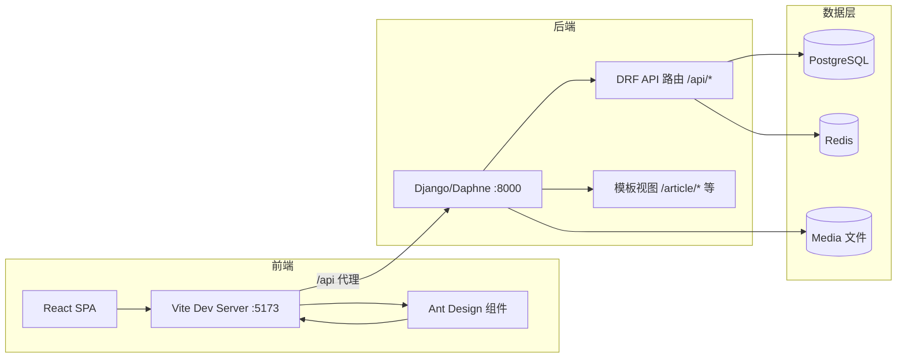
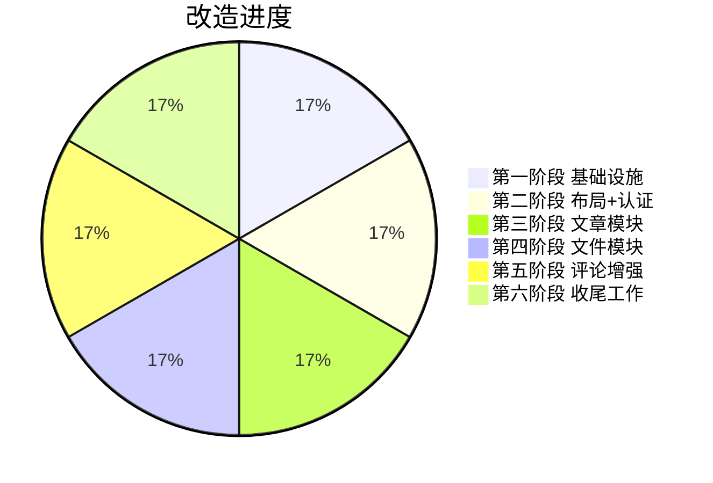

# NCBCNet 前端改造计划

> **目标**：将项目从「Django 模板引擎渲染」逐步迁移至「Vite + React + Ant Design 前后端分离」架构，同时保持与原有站点一致的紫色（`#6f42c1`）设计风格。

---

## 一、项目背景

NCBCNet（南城网）是一个面向校园/社区的综合 Web 服务平台，核心功能包括：

- **文章系统**：Markdown 编辑、标签分类、栏目管理、点赞
- **评论系统**：无限嵌套回复、富文本编辑
- **云上网盘**：树形文件夹、文件共享、大文件上传
- **用户系统**：注册登录、资料管理、头像上传

原架构使用 Django 模板引擎（DTL）服务端渲染，前端为手写 HTML + Bootstrap 5.3.3 + jQuery。项目已包含一个早期的 React/Vite 前端骨架，但存在大量占位页面、硬编码地址、风格不一致等问题。

## 二、技术栈决策

| 层级 | 原方案 | 新方案 | 说明 |
|------|--------|--------|------|
| **前端框架** | Bootstrap 5.3.3 + jQuery | **React 19 + Ant Design 6** | Ant Design 提供完整的 React 组件体系 |
| **构建工具** | Django 静态文件 | **Vite 7** | 现代构建、HMR 热更新 |
| **路由** | Django URL | **React Router 7** | 前端 SPA 路由 |
| **API** | 模板视图 + JsonResponse | **Django REST Framework** | 统一 REST API |
| **认证** | Session + Redis 缓存 | **JWT Token** | `djangorestframework-simplejwt`，支持前后端分离 |
| **状态管理** | jQuery + 原生 JS | **React Context** | `AuthProvider` 认证状态 |
| **富文本** | CKEditor / Editor.md | **@uiw/react-md-editor** | React Markdown 编辑器 |
| **Markdown 渲染** | Python markdown 库 | 后端渲染 + **DOMPurify** | 后端返回 HTML，前端安全过滤 |
| **图标** | Font Awesome 5 | **@ant-design/icons** | 与 Ant Design 配套 |

### 设计风格规范

```js
// 主色调：紫色（与原有 Bootstrap 主题一致）
colorPrimary: '#6f42c1'
colorLink: '#6f42c1'
borderRadius: 6
```

### 核心设计原则

1. **分批次逐步迁移**：保留现有 Django 模板视图不动，新建 DRF API 视图供前端调用，两条线并行，降低迁移风险。
2. **API 前缀隔离**：所有新 API 统一使用 `/api/` 前缀，与模板路由（`/article/`、`/file_up/` 等）互不干扰。
3. **JWT 自动刷新**：Axios 拦截器自动附加 token，过期自动刷新，无需用户重新登录。
4. **Vite 代理转发**：开发时前端请求 `/api`、`/media`、`/static` 自动代理到 Django 后端。

---

## 三、架构设计

### 3.1 整体架构



### 3.2 前端目录结构

```
frontend/src/
├── main.jsx                 # 入口：ConfigProvider(紫色主题) + AuthProvider + Router
├── App.jsx                  # 布局：导航栏 + 路由 + 页脚
├── App.css                  # 全局布局样式
├── index.css                # 基础样式 + Markdown 内容样式
├── components/              # 复用组件（预留）
├── pages/                   # 页面组件
│   ├── Home.jsx             # 首页（轮播图 + 功能卡片）
│   ├── About.jsx            # 关于页面
│   ├── Login.jsx            # 登录
│   ├── Register.jsx         # 注册
│   ├── Profile.jsx          # 个人资料
│   ├── ArticleList.jsx      # 文章列表
│   ├── ArticleDetail.jsx    # 文章详情
│   ├── ArticleCreate.jsx    # 创建文章
│   ├── ArticleEdit.jsx      # 编辑文章
│   ├── FileList.jsx         # 文件列表（待改造）
│   └── FileUpload.jsx       # 文件上传（待改造）
├── services/                # API 请求层
│   ├── api.js               # Axios 实例 + JWT 拦截器
│   └── authService.js       # 认证 API 封装
└── store/
    └── authStore.jsx        # React Context 认证状态
```

---

## 四、分阶段改造计划

### ✅ 第一阶段：基础设施搭建（已完成）

| 步骤 | 内容 | 状态 |
|------|------|------|
| **1.1** | 安装 `djangorestframework-simplejwt`，配置 `REST_FRAMEWORK` + `SIMPLE_JWT` | ✅ |
| **1.2** | 创建 `api/` 应用：Serializers、Views、URLs | ✅ |
| **1.3** | 前端目录重构（`services/`、`store/`、`components/`），配置 Vite 代理 | ✅ |
| **1.4** | Axios 实例 + JWT 拦截器 + 自动刷新 token | ✅ |
| **1.5** | Ant Design `ConfigProvider` 紫色主题 + 中文 locale | ✅ |

**交付物**：

- `NCBCNet/settings.py` — REST_FRAMEWORK、SIMPLE_JWT 配置
- `NCBCNet/urls.py` — JWT 端点 + API 路由
- `api/` — 完整 API 应用（auth / articles / files / comments）
- `frontend/src/services/api.js` — Axios + JWT 拦截器
- `frontend/src/store/authStore.jsx` — 认证状态管理
- `frontend/src/main.jsx` — 主题配置

---

### ✅ 第二阶段：公共布局 + 用户认证（已完成）

| 步骤 | 内容 | 状态 |
|------|------|------|
| **2.1** | 公共布局：Ant Design Layout + 紫色导航栏 + 用户下拉菜单 | ✅ |
| **2.2** | 用户 API：注册、用户详情、删除、检查登录 | ✅ |
| **2.3** | 登录 / 注册 / 个人资料页面 | ✅ |
| **2.4** | 首页 + 关于页面 | ✅ |

**交付物**：

- `frontend/src/App.jsx` — 导航栏（首页/论坛/学习/云盘/关于）+ 用户菜单（个人信息/写文章/后台管理/退出/删除用户）
- `frontend/src/pages/Login.jsx` — JWT 登录
- `frontend/src/pages/Register.jsx` — 注册（自动登录）
- `frontend/src/pages/Profile.jsx` — 头像上传 + 邮箱/电话/简介编辑
- `frontend/src/pages/Home.jsx` — 轮播图 + 功能卡片
- `frontend/src/pages/About.jsx` — 项目介绍 + 技术栈标签

---

### ✅ 第三阶段：文章模块（已完成）

| 步骤 | 内容 | 状态 |
|------|------|------|
| **3.1** | 文章 API：列表（分页/搜索/排序/筛选）、详情、CRUD、点赞、栏目 | ✅ |
| **3.2** | 文章列表页 | ✅ |
| **3.3** | 文章详情页（Markdown 渲染 + 目录 + 点赞 + 评论） | ✅ |
| **3.4** | 创建 / 编辑文章页（Markdown 编辑器） | ✅ |

**交付物**：

- `frontend/src/pages/ArticleList.jsx` — 搜索/排序/栏目筛选/分页，URL 参数同步
- `frontend/src/pages/ArticleDetail.jsx` — DOMPurify 安全渲染、Affix 目录、递归评论组件
- `frontend/src/pages/ArticleCreate.jsx` / `ArticleEdit.jsx` — `@uiw/react-md-editor` 编辑器
- `api/serializers/articles.py` — `ArticleDetailSerializer` 新增 `toc` 字段

---

### ✅ 第四阶段：文件管理模块（已完成）

| 步骤 | 内容 | 状态 |
|------|------|------|
| **4.1** | 文件 API：文件夹 CRUD、文件列表/上传/删除/下载/共享切换 | ✅ |
| **4.2** | 重写 `FileList.jsx`（AntD 树/面包屑/统计/网格/共享/签名下载） | ✅ |
| **4.3** | 重写 `FileUpload.jsx`（进度/速度/剩余时间/文件夹选择） | ✅ |

**待完成内容**：

- **`FileList.jsx`** — 使用 Ant Design 重写：
  - 上传区域（带进度条 `Progress` + 速度/剩余时间显示）
  - 创建文件夹
  - 面包屑导航
  - 统计卡片（文件夹数、文件数、总大小）
  - 文件夹/文件网格视图
  - 共享文件展示
  - 删除确认（Ant Design `Modal.confirm` 替代 layer.js）
  - 下载（跳转 `/file_up/file_download/{id}/`）
- **`FileUpload.jsx`** — 上传进度条（Axios `onUploadProgress`）
- 对接 API：`/api/folders/`、`/api/files/`、`/api/files/upload/`、`/api/files/{id}/share/` 等

---

### ✅ 第五阶段：评论模块增强（已完成）

| 步骤 | 内容 | 状态 |
|------|------|------|
| **5.1** | 评论 API：发表评论、回复评论（嵌套） | ✅ |
| **5.2** | 抽取独立 `CommentTree` 组件 | ✅ |

**待完成内容**：

- 将 `ArticleDetail.jsx` 中的递归评论渲染抽取为独立组件 `components/CommentTree.jsx`
- 支持回复、@提及、删除评论（可选）

---

### ✅ 第六阶段：收尾工作（已完成）

| 步骤 | 内容 | 状态 |
|------|------|------|
| **6.1** | 清理：统一错误处理、加载态（`Spin`）、404/403/500 页面、ErrorBoundary | ✅ |
| **6.2** | 生产构建：`docker/nginx.Dockerfile` 集成前端、Nginx SPA 路由 + CSP | ✅ |
| **6.3** | 代码分割优化（`React.lazy` + `Suspense` 路由级分包） | ✅ |

**待完成内容**：

1. **错误边界（Error Boundary）**：为组件树添加错误边界，自定义错误处理。
2. **路由懒加载**：使用 `React.lazy` + `Suspense` 按路由分割代码，解决 `vite build` 大包警告。
3. **404/403/500 页面**：前端错误页面。
4. **Docker 集成**：`Dockerfile` 多阶段构建（Node 构建前端 → Python 运行时），`docker-compose.yml` 集成前端服务。
5. **Nginx SPA 路由**：`location / { try_files $uri /index.html; }` 支持前端路由刷新。

---

## 五、API 端点清单

### 认证

| 方法 | 路径 | 说明 | 权限 |
|------|------|------|------|
| POST | `/api/token/` | 登录获取 JWT | 公开 |
| POST | `/api/token/refresh/` | 刷新 token | 公开 |
| POST | `/api/token/verify/` | 验证 token | 公开 |
| POST | `/api/auth/register/` | 注册 | 公开 |
| GET/PATCH | `/api/auth/me/` | 获取/更新用户 | 登录 |
| DELETE | `/api/auth/delete/` | 删除用户 | 登录 |
| GET | `/api/auth/check/` | 检查登录状态 | 登录 |

### 文章

| 方法 | 路径 | 说明 | 权限 |
|------|------|------|------|
| GET | `/api/articles/` | 文章列表（分页/搜索/排序/筛选） | 公开 |
| POST | `/api/articles/create/` | 创建文章 | 登录 |
| GET | `/api/articles/{id}/` | 文章详情（+浏览量） | 公开 |
| PUT | `/api/articles/{id}/update/` | 更新文章 | 作者 |
| DELETE | `/api/articles/{id}/delete/` | 删除文章 | 作者 |
| POST | `/api/articles/{id}/like/` | 点赞 | 登录 |
| GET | `/api/articles/columns/` | 栏目列表 | 公开 |

### 评论

| 方法 | 路径 | 说明 | 权限 |
|------|------|------|------|
| POST | `/api/articles/{id}/comments/` | 发表评论 | 登录 |
| POST | `/api/articles/{id}/comments/{cid}/reply/` | 回复评论 | 登录 |

### 文件

| 方法 | 路径 | 说明 | 权限 |
|------|------|------|------|
| GET/POST | `/api/folders/` | 文件夹列表/创建 | 登录 |
| DELETE | `/api/folders/{id}/delete/` | 删除文件夹 | 登录 |
| GET | `/api/files/` | 文件列表 | 登录 |
| POST | `/api/files/upload/` | 上传文件 | 登录 |
| DELETE | `/api/files/{id}/delete/` | 删除文件 | 登录 |
| POST | `/api/files/{id}/share/` | 切换共享状态 | 登录 |
| GET | `/api/files/shared/` | 共享文件列表 | 登录 |

---

## 六、已遇到的问题与规避方案

### Ant Design v6 API 变更（重点）

本项目使用 `antd@6.3.5`，v6 中部分 v5 常用 API 已**废弃（Deprecated）**，使用会触发运行时错误：

| 废弃 API | 替代方案 | 示例 |
|----------|---------|------|
| `Card` 的 `bodyStyle` | `styles.body` | `styles={{ body: { padding: 20 } }}` |
| `Card` 的 `headStyle` | `styles.header` | — |
| `Breadcrumb.Item` | `items` 属性 | `items={[{ title: '...' }]}` |
| `Select` 的 `dropdownStyle` | `styles.popup.root` | — |
| `Modal` 的 `bodyStyle` | `styles.body` | — |
| `size="default"` | `size="medium"` | — |

> ⚠️ 更多变更参考：[Ant Design v6 迁移文档](https://ant.design/docs/react/migration-v6-cn)

### 前端常见坑点

1. **`.jsx` 文件不能使用 `import type`**：会触发 esbuild 构建错误，如需类型导入请使用 `.tsx` 或直接移除。
2. **头像 URL 类型保护**：API 返回的 `avatar` 可能为 `null` 或非字符串，渲染前需检查 `typeof avatar === 'string'`。
3. **npx 与 npm 的区别**：`npx vite` 可能拉取全局最新版（如 vite 8），需用 `npm run dev` 确保使用项目本地版本。

---

## 七、验证方案

| 阶段 | 验证内容 |
|------|---------|
| 第一阶段 | `POST /api/token/` 返回 JWT；`python manage.py check` 无错误 |
| 第二阶段 | 前端注册 → 登录 → 导航栏显示用户名 → 退出完整流程 |
| 第三阶段 | 文章列表分页/搜索 → 详情 → 评论 → 创建/编辑/删除 |
| 第四阶段 | 创建文件夹 → 上传 → 下载 → 删除 → 共享切换 |
| 收尾 | `vite build` 成功；Docker 构建成功；Nginx 前端路由刷新正常 |

---

## 八、项目文件索引

### 后端新增/修改

```
NCBCNet/settings.py          # REST_FRAMEWORK + SIMPLE_JWT + api 应用注册
NCBCNet/urls.py              # JWT 端点 + /api/ 路由
api/
├── apps.py                  # ApiConfig
├── urls.py                  # 全部 API 路由
├── serializers/
│   ├── auth.py              # User / Register / Profile
│   ├── articles.py          # Article / Column / Comment
│   └── files.py             # Folder / File
└── views/
    ├── auth.py              # 注册/用户/删除/检查
    ├── articles.py          # 列表/详情/CRUD/点赞/栏目
    ├── files.py             # 文件夹/文件/上传/共享
    └── comments.py          # 评论/回复
requirements.docker.txt      # + djangorestframework-simplejwt
requirements.txt             # + djangorestframework-simplejwt
```

### 前端新增/修改

```
frontend/vite.config.js                    # /api /media /static 代理
frontend/src/main.jsx                      # 主题 + AuthProvider
frontend/src/App.jsx                       # 布局 + 路由
frontend/src/App.css                       # 布局样式
frontend/src/index.css                     # 基础样式
frontend/src/services/api.js               # Axios + JWT 拦截器
frontend/src/services/authService.js       # 认证 API
frontend/src/store/authStore.jsx           # 认证状态
frontend/src/pages/Home.jsx                # ✅ 已完成
frontend/src/pages/About.jsx               # ✅ 已完成
frontend/src/pages/Login.jsx               # ✅ 已完成
frontend/src/pages/Register.jsx            # ✅ 已完成
frontend/src/pages/Profile.jsx             # ✅ 已完成
frontend/src/pages/ArticleList.jsx         # ✅ 已完成
frontend/src/pages/ArticleDetail.jsx       # ✅ 已完成
frontend/src/pages/ArticleCreate.jsx       # ✅ 已完成
frontend/src/pages/ArticleEdit.jsx         # ✅ 已完成
frontend/src/pages/FileList.jsx            # ✅ 已完成（AntD 重写 + 签名下载）
frontend/src/pages/FileUpload.jsx          # ✅ 已完成（进度/速度/ETA）
frontend/src/components/CommentTree.jsx     # ✅ 已完成
frontend/src/components/ErrorBoundary.jsx   # ✅ 已完成
frontend/src/pages/NotFound.jsx            # ✅ 已完成（含 403/500）
```

---

## 九、当前进度概览



> **迁移已全部完成。** 认证方案由「localStorage JWT」升级为 **HttpOnly Cookie JWT + CSRF**，
> API 前缀统一为 `/api/v1/`（见 `ARCHITECTURE_ROADMAP.md` M1），私有文件下载走签名短链。
> 前端构建由 `docker/nginx.Dockerfile` 在镜像构建期完成，生产由 Nginx 直接服务 SPA。
